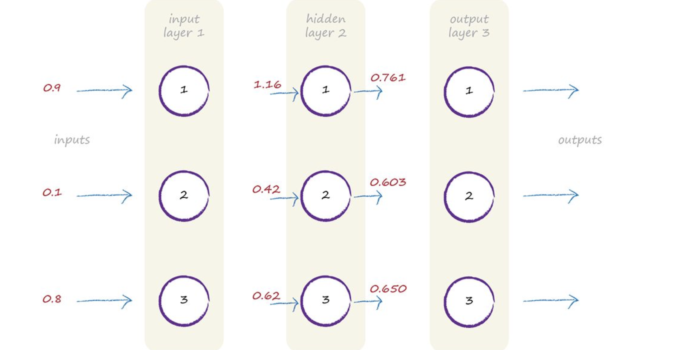
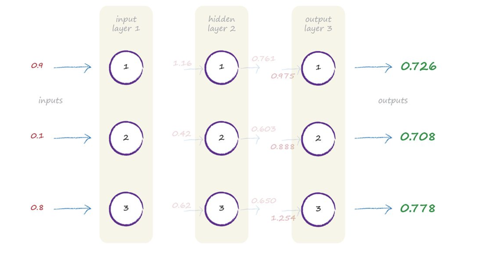
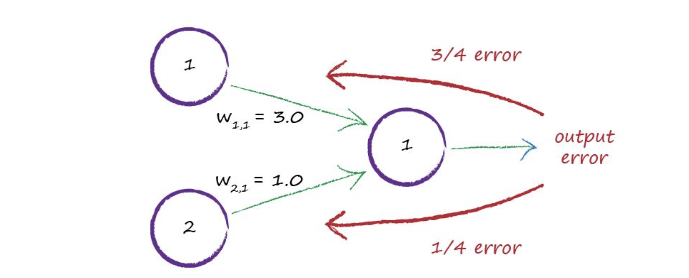
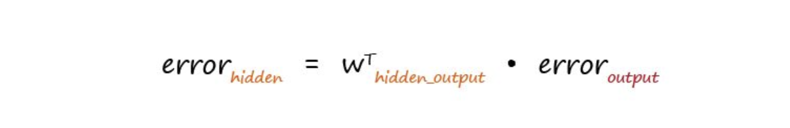
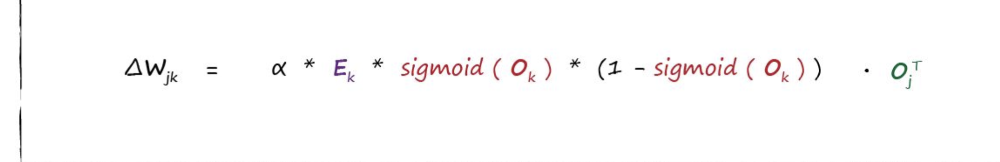

## Dataset
- Data : 

## np.isnan(arr)
- return true or false if in the array has nan.

## np.argwhere(condition)

- print index based on condition

## preprocessing
- normalize : give the image from [0, 255] --> [0, 1]
- in one picture: grey = 0.299×R+0.587×G+0.114×B
- pixel value: data.shape[2]
- np.split(arr, number for sub-split,axis)

## MLP model

## Simple model
- Input : 0.9, 0.1, 0.8 ---> I = [0.9, 0.1, 0.8].T
- At layer i has 3 nodes --> j has 3 nodes: W[1, 2] = Value of weight  node 1 from layer i to node 2 from layer j
- W = 3x3 if fully connected and has 3 nodes
- X_hidden = W @ I
- Activation step : O_hidden = sigmoid(X_hidden)
- The hidden layer now is : 

- Keep going and then we will reach 

- Error: When the output node get errors, we could split the error to N link (W) contribute to the output node and based on their weights to judge the error.
- Example : 
- Weight to calculate and to propagate the error
- the important of weights[1] for error[1]: w[1] / total sum of W for O[1]
- Errors of nodes : Sum of error in weights (based on the important of weights) has connected to its. 
- Error of Node --> Calc important of w --> Error of weights --> Error of hidden layer
- 
- Gradient descent: Minimize the current Error function

## Dense layer
- Is fully connected by prev node
- Units : Define size of the output from dense layer
- Activation function
- use_bias : BOOl
- 
